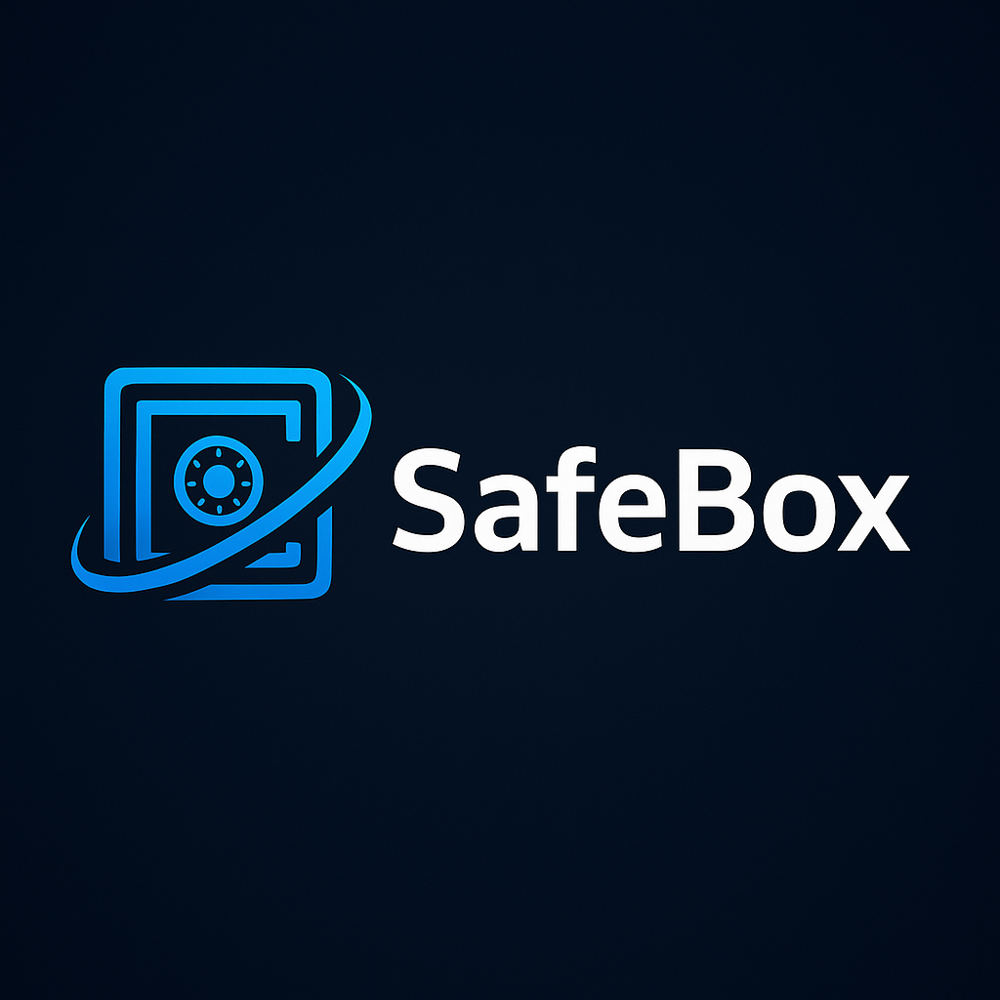

# Safebox – Ethereum-Powered Secure Password & Ether Manager 🔐💰

**Safebox** is a secure and upgradeable Ethereum-based system for **storing passwords, managing Ether, and upgrading contract logic**. It combines **smart contracts** with **Node.js scripts** and uses **AES encryption** to protect sensitive data.

---

## Features ✨

- Securely store passwords on the blockchain using the **Executive contract**  
- Retrieve and delete passwords with full control  
- Deposit and withdraw Ether via the **Safebox contract**  
- **Upgradeable contract logic** without losing stored data (Proxy Pattern)  
- AES encryption ensures strong data protection  
- Local JSON storage to track passwords and creation dates  

---

## Project Architecture 🏗️

1. **Smart Contracts:**
   - `Safebox.sol`: Ether management & contract upgrade functionality  
   - `Implementation.sol`: Password storage and retrieval  

2. **Node.js Scripts:**
   - `index.js`: Functions to manage passwords and Ether  
   - `cryptoUtils.js`: AES encryption & decryption utilities  
   - `run.js`: Command-line interface for interacting with the system  

3. **Storage:**
   - Local JSON file for tracking passwords and metadata  

---

## Installation & Setup ⚙️

1. Clone the repository:
```bash
git clone <repo_url>
cd <repo_folder>
```

2. Install dependencies:
```bash
npm install
```

3. Create a `.env` file and add:
```
PRIVATE_KEY=your_wallet_private_key
SAFEBOX=deployed_safebox_contract_address
```

4. Run the run.js:
```bash
npm run.js <function> [params]
```

**Examples:**
```bash
npm run.js setPassword "mySecret123" "EmailAccount"
npm run.js getPassword 1
npm run.js sendEther "0x123...abc" 0.1
npm run.js getbalance
```

---

## Security 🔒

- Data is encrypted using **AES-CBC**  
- Only the contract owner can manage passwords and Ether  
- The Safebox contract uses **delegatecall and proxy pattern** for secure upgrades  

---

## Technologies 🛠️

- Solidity ^0.8.20  
- Node.js + Ethers.js  
- AES encryption via Web Crypto API  
- Sepolia Testnet  
- Local JSON storage  

---

## Future Roadmap 🚀

- Add a **web-based interface** for password & Ether management  
- Multi-user support with role-based access control  
- Enhanced encryption and contract security  

---

## Summary 🏆

**Safebox** combines **blockchain security with professional password management**, providing encryption, Ether handling, and upgradeable logic in a single system. It’s ready to be deployed and used in real-world Ethereum environments.
>>>>>>> b4bf5b8 (v1.0.0)
